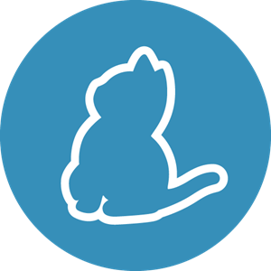

# [en] Hello, my name is Leonam

I am a computer engineering student at CEFET-MG and I love software development.

* Web development (Angular and Node)
* Mobile development (Flutter)
* Task automation and a little bit of data analysis (Python)

## Interests

* Mobile and web development
* Data analysis and machine learning
* Infrastructure (Linux + Docker)

You'll find some of my projects in this github profile!

# [pt-br] Olá, meu nome é Leonam 

Sou estudante de engenharia de computação no CEFET-MG e apaixonado por desenvolvimento de software.

* Desenvolvimento web (Angular e Node)
* Desenvolvimento Mobile (Flutter)
* Automação de tarefas e um pouco de análise de dados (Python)

Vocês encontrarão alguns de meus projetos neste perfil do github!

## Interesses

* Desenvolvimento Mobile e Web
* Análise de dados e Machine Learning
* Infraestrutura (Linux + Docker)

## Ferramentas utilizadas / Tools that I use

### Linguagens | Languages
<table border="0">
    <tr>
        <td>
            
        </td>
        <td>
            
        </td>
        <td>
            
        </td>
        <td>
            
        </td>
        <td>
            
        </td>
    </tr>
</table>

### Frameworks e Ambientes de execução | Frameworks and Runtime environments
<table border="0">
    <tr>
        <td>
            
        </td>
        <td>
            
        </td>
        <td>
            
        </td>
        <td>
            
        </td>
   </tr>
</table>

### IDE's e editores de texto | IDE's and text editors
<table border="0">
    <tr>
        <td>
            
        </td>
        <td>
            
        </td>
        <td>
            
        </td> 
        <td>
            
        </td> 
        <td>
            
        </td> 
    </tr>
</table>

### Outras ferramentas | Miscellaneous tools
<table border="0">
    <tr>
        <td>
            
        </td>
        <td>
            
        </td>
        <td>
            
        </td>
        <td>
            
        </td> 
        <td>
            
        </td> 
        <td>
            
        </td> 
        <td>
            
        </td> 
    </tr>
</table>

### Sistemas operacionais | Operating Systems
<table border="0">
    <tr>
        <td>
            
        </td>
        <td>
            
        </td>
    </tr>
</table>

### Banco de dados | Databases
<table border="0">
    <tr>
        <td>
            
        </td>
        <td>
            
        </td> 
    </tr>
</table>

## Contatos, informações e perfis / Contact, information and profiles
<table  border="0">
    <tr>
        <td>
            
        </td>
        <td>
            
        </td>
        <td>
            
        </td>
        <td>
            
        </td>
        <td>
            
        </td>
        <td>
            
        </td>
    </tr>
</table>

